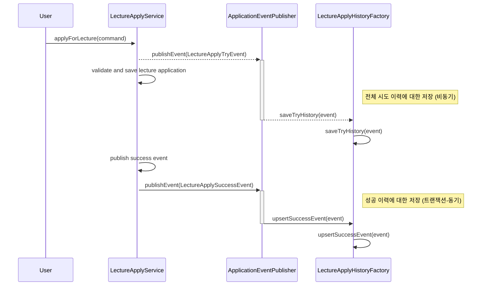

```mermaid
sequenceDiagram
participant User as User
participant LectureApplyService as LectureApplyService
participant ApplicationEventPublisher as ApplicationEventPublisher
participant LectureApplyHistoryFactory as LectureApplyHistoryFactory

User->>+LectureApplyService: applyForLecture(command)
LectureApplyService-->>+ApplicationEventPublisher: publishEvent(LectureApplyTryEvent)
LectureApplyService->>LectureApplyService: validate and save lecture application
Note right of LectureApplyHistoryFactory: 전체 시도 이력에 대한 저장 (비동기)
ApplicationEventPublisher-->>-LectureApplyHistoryFactory: saveTryHistory(event)
LectureApplyHistoryFactory->>LectureApplyHistoryFactory: saveTryHistory(event)


LectureApplyService->>LectureApplyService: publish success event
LectureApplyService->>+ApplicationEventPublisher: publishEvent(LectureApplySuccessEvent)
Note right of LectureApplyHistoryFactory: 성공 이력에 대한 저장 (트랜잭션-동기)
ApplicationEventPublisher->>-LectureApplyHistoryFactory: upsertSuccessEvent(event)
LectureApplyHistoryFactory->>LectureApplyHistoryFactory: upsertSuccessEvent(event)
```